# Guide for setting up Ethernet for the ESP32 Development board

- I will be using the LAN8720 PHY as it has driver support in the esp-idf and its very cheap and available, I got mine for around 5$.
- **Important Note :** The newer ESP32 Modules dropped Ethernet MAC support for some reason, so this guide is only valid for older modules.
    - You can check whether your module has the peripheral and compare between different modules from [ESP Product Selector](https://products.espressif.com/#/product-comparison).

## Few Notes on Ethernet PHY

* You can safely skip this part if you want to, the connections and code are provided at the end.

<p align="center">
  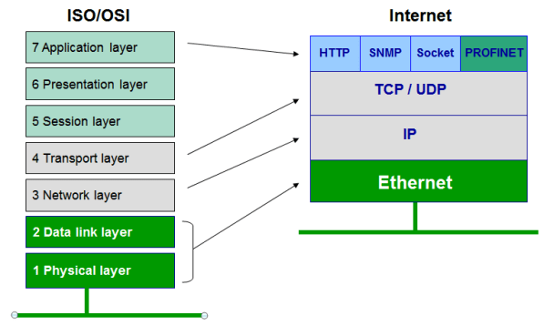
</p>


### High level block diagram of Ethernet Connection 

1. **The Media Access Controller (MAC) :** The MAC is usually integrated into a processor and controls the data-link-layer portion of the OSI model. 
    * The data link layer defines the way in which communication takes place over the medium and the frame structure for the transmitted and received messages

2. **The Ethernet Physical Layer (PHY) :** The Ethernet Physical Layer (PHY) is the physical interface transceiver that implements the physical layer portion of the OSI model, its responsible for the physical link between the Ethernet controller and the network.
    * The physical layer defines the electrical and optical signals, line status, clock reference, data encoding and circuits required for data transmission and reception, and communicates to the data link Layer devices provide standard interfaces.

3. **Magnetics :** The magnetics allow different nodes on the Ethernet network to connect over long distances. It
removes any connection issues created by different ground offsets at different nodes.

4. **RJ45 connector :** The RJ45 connector is a standard connector format for Ethernet link. It allows for a similar
approach to cabling up USB, whereby standard connectors, with a standard pinout are used at each node.

<p align="center">
  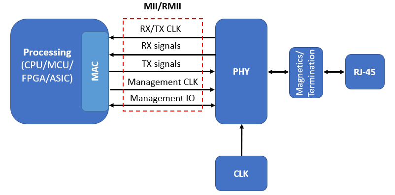
</p>

* The ESP32 already contains an Internal Ethernet Media Access Controller (MAC) and it can send and recieve data by using the external Ethernet PHY (physical layer), here comes the role of the LAN8720 which provides everything from the PHY to the RJ45 Connector in a small easy to use package

* **The communication between MAC and PHY can have diverse choices:**
    * **MII** (Media Independent Interface)
    * **RMII** (Reduced Media Independent Interface)

<p align="center">
  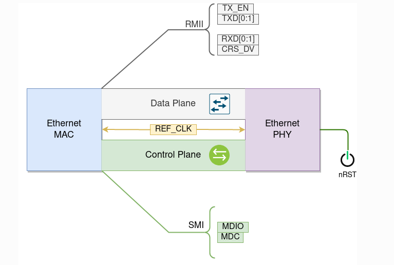
</p>


* **MII has two signal interfaces :**
    * **A Data Interface :** for sending and receiving Ethernet frame data.
    * **A PHY management interface (MDIO also known as SMI or MIIM):** used to read and write the control and status registers of the PHY in order to configure each PHY before Operation, and to monitor link status during operation.
    * **From the hardware point of view, the MIIM consists of the following two signals :** 
        * **MDC :** Management Data clock that is driven by the MAC device to the PHY (25 MHz clock).
        * **MDIO data :** Management Data Input/output, the PHY drives it to provide register data.

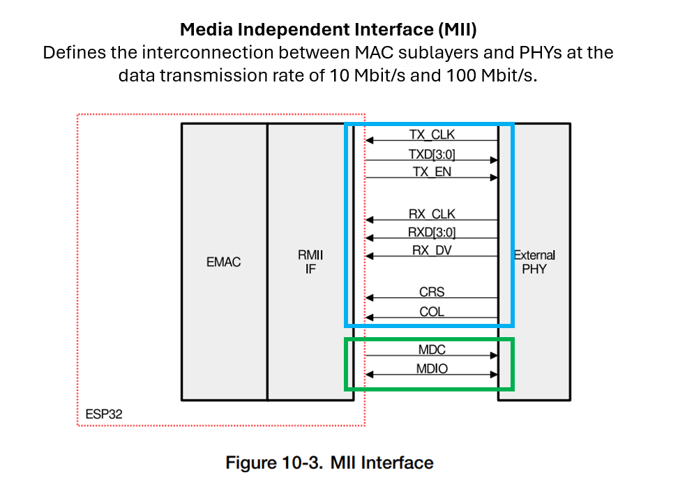

* The **Reduced Media-Independent Interface (RMII)** specification reduces the number of pins between the microcontroller’s external peripherals and the external PHY at a data transmission rate of 10 Mbit/s or 100 Mbit/s. 
    * MII includes 16 pins that contain data and control signals, RMII specification reduces it to 7.

* **RMII has the following features:**
    * Support for an operating rate of 10 Mbit/s or 100 Mbit/s
    * The reference clock frequency **must be 50 MHz**.
    * The same reference clock must be provided externally both to the MAC and the external Ethernet PHY.
    * It provides independent 2-bit-wide Tx and Rx data paths.

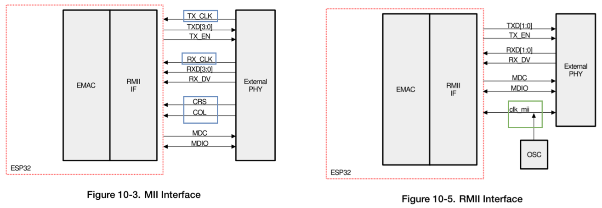

## Ways to Generate the Reference Clock

1- Using an externally connected 50MHz crystal oscillator which can be used for both the PHY and MAC.

<p align="center">
  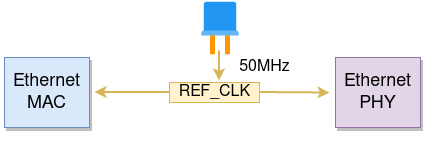
</p>

2- Using an externally connected lower cost 25MHz fundamental crystal that The PHY uses to output a 50MHz clock output to the MAC.

<p align="center">
  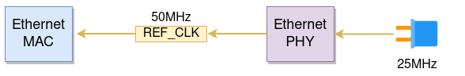
</p>

3- Internal MAC can generate the reference clock using an internal high-precision PLL and feed it to the PHY.


<p align="center">
  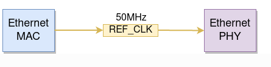
</p>

---

# Problem 

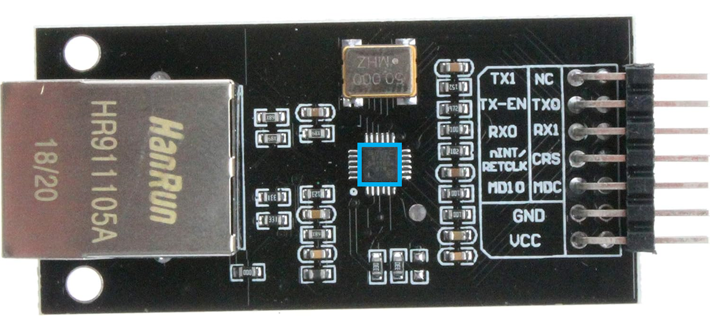

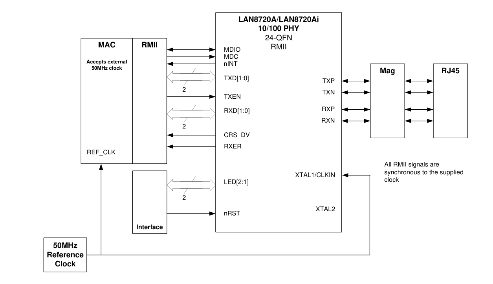

- The LAN8720 board contains an external 50 MHz oscillator so the first way to generate reference clock is the logical option, but !

* `GPIO0` is the only choice to input the reference clock in the ESP32
    * But the `GPIO0` pin have an important role in selecting the Bootloader Mode as the esp32 will enter the serial bootloader (programming mode) when `GPIO0` is held low on reset, otherwise it will run the program in flash.
 
* The famous workaround for this issue is to disable the reference clk in hardware by default and then re-enable it at the driver installation stage. 
    * This can be done using the `Enable` pin of the oscillator, you can solder it to the `NC` (not connected) pin of the LAN8720 and connect it to an extra pin (power pin) in the ESP32 to disable the oscillator at reset and then re-enable it while installing the driver 

* **Sautter made an excellent demonstration here to this workaround** :
    - [Sautter LAN8720](https://sautter.com/blog/ethernet-on-esp32-using-lan8720/)

### This workaround is problematic for me for two reasons :

1- I am using the dev-kit-v1 board which has no `GPIO0` and I didnt really want to solder my chip but its possible if you want to.

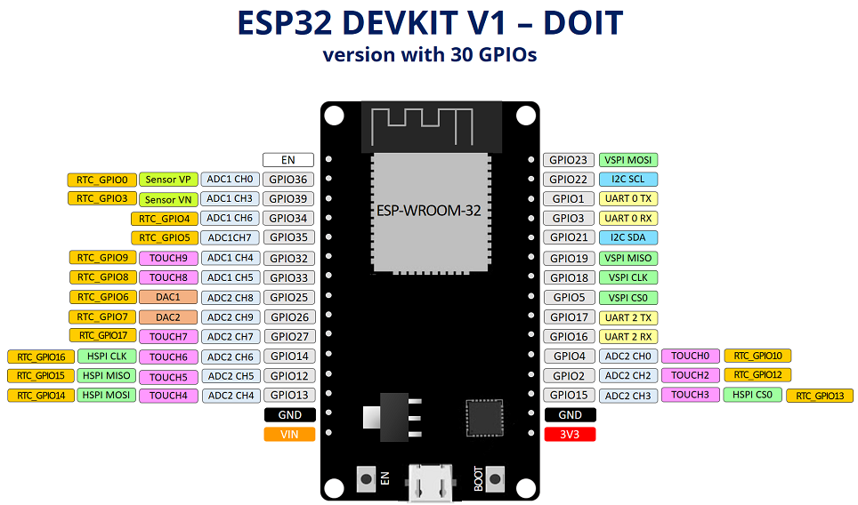

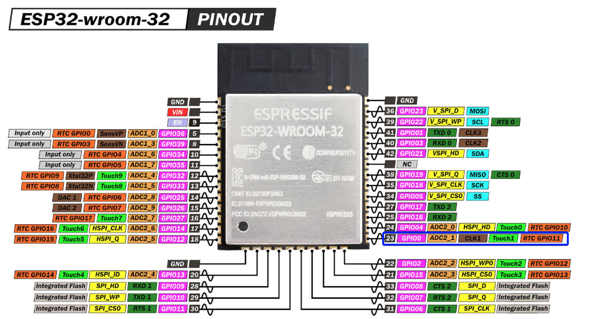

2- it requires a modification to the ethernet driver and an extra "power pin" which I didnt like.

## Another Solution

* In the espressif docs I noticed an important paragraph

> What is more, if you are not using PSRAM in your design, GPIO16 and GPIO17 are also available to output the reference clock.

- Using the third way of generating the reference clock, I wont really need the 50 MHz of the external oscillator I can use the ESP32 internal PLL to generate the reference clock and avoid the headache of `GPIO0` all together. 
- My DEVKIT contained `GPIO17` which outputs an Inverted output of 50MHz APLL clock which was found to be the most stable option for long signal wires.
- The only thing needed was to disable the external oscillator all together and use the ESP32 clock instead.

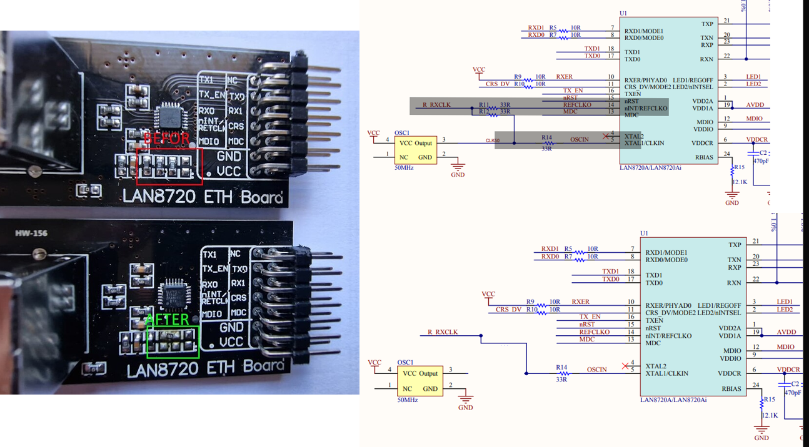

- After examining the datasheet you can remove connection by moving the 33 ohm resistors. 

- I didnt want to modify the board so I just soldered the enable pin of the oscillator to the `NC` and just grounded the `NC` permanently this way I can still revert to the previous workaround If I wanted to.

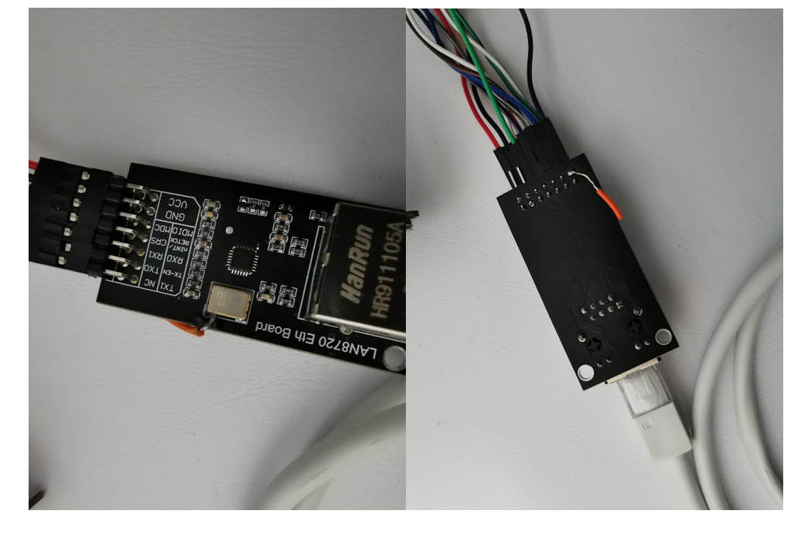

## Wiring and Connections

* You cannot change the following connections they are fixed.

| GPIO   | RMII Signal | Notes        |
| ------ | ----------- | ------------ |
| GPIO21 | TX_EN       | EMAC_TX_EN   |
| GPIO19 | TX0         | EMAC_TXD0    |
| GPIO22 | TX1         | EMAC_TXD1    |
| GPIO25 | RX0         | EMAC_RXD0    |
| GPIO26 | RX1         | EMAC_RXD1    |
| GPIO27 | CRS_DV      | EMAC_RX_DRV  |


| GPIO   | Function             | Notes        |
| ------ | -------------------- | ------------ |
| GPIO17 | EMAC_CLK_180         | REFCLK       |

* SMI (Serial Management Interface) wiring is not fixed. 
    * You may need to changed it according to your board schematic, by default they're connected as follows:

| GPIO   | SMI Signal  | Notes         |
| ------ | ----------- | ------------- |
| GPIO23 | MDC         | Output to PHY |
| GPIO18 | MDIO        | Bidirectional |

* Dont forget to solder the `Enable` pin of the Oscillator to the `NC` in LAN8720 and connect the `NC` to the ESP32 `GND`.

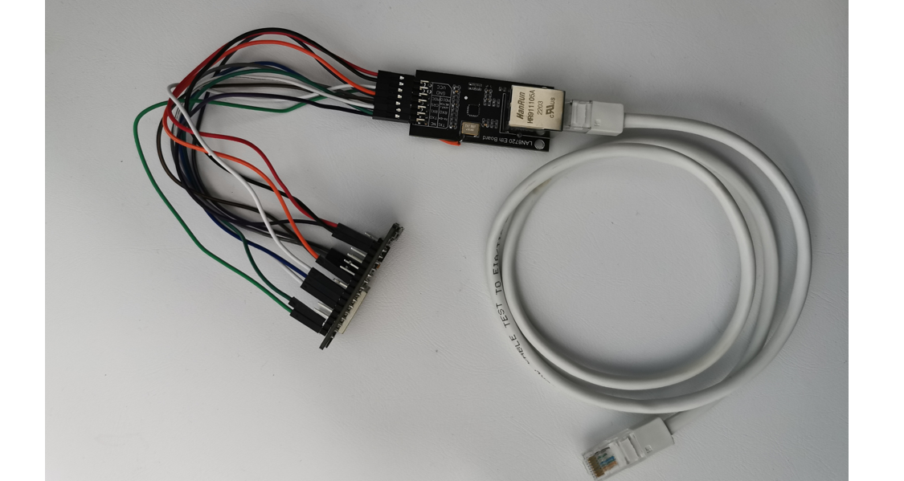


## Performance
* I honestly didnt expect much because the traces were very long but the result was acceptable to me.
    * I tested it extensively for long periods and I didnt notice any drops or weird behaviour.

### Latency 

* This measures RTT for small packets at a 100ms rate, its somewhat stable.

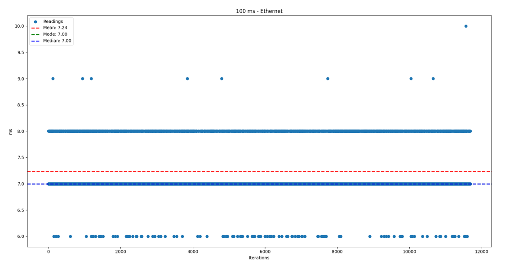

### Throughput
* Using the iperf example in the esp-idf, I honestly didnt have a use case to test the limits of the throughput.

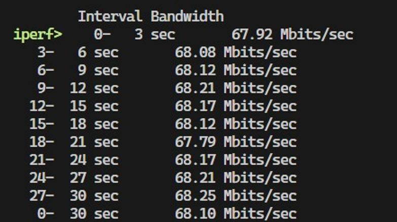

## Code

* I am here using the esp-idf, this is a minimal driver extracted from the examples.

```c
#include <stdio.h>
#include <stdint.h>
#include <stddef.h>
#include <string.h>

#include "freertos/FreeRTOS.h"
#include "freertos/task.h"
#include "freertos/semphr.h"
#include "freertos/queue.h"
#include "freertos/event_groups.h"

#include "esp_netif.h"
#include "esp_eth.h"
#include "esp_wifi.h"
#include "esp_system.h"
#include "nvs_flash.h"
#include "esp_event.h"
#include "esp_log.h"
#include "esp_eth_driver.h"
#include "esp_check.h"
#include "esp_mac.h"

#include "lwip/sockets.h"
#include "lwip/dns.h"
#include "lwip/netdb.h"

#define ETH_PHY_ADDR         1
#define ETH_PHY_RST_GPIO    -1          // not connected
#define ETH_MDC_GPIO        23
#define ETH_MDIO_GPIO       18

static EventGroupHandle_t s_eth_event_group;

#define ETHERNET_CONNECTED_BIT BIT0
#define ETHERNET_FAIL_BIT      BIT1

#define STATIC_IP 0


/** Event handler for Ethernet events */
static void eth_event_handler(void *arg, esp_event_base_t event_base, int32_t event_id, void *event_data)
{
    uint8_t mac_addr[6] = {0};
    /* we can get the ethernet driver handle from event data */
    esp_eth_handle_t eth_handle = *(esp_eth_handle_t *)event_data;

    switch (event_id) {
    case ETHERNET_EVENT_CONNECTED:
        esp_eth_ioctl(eth_handle, ETH_CMD_G_MAC_ADDR, mac_addr);
        ESP_LOGI(ETH_TAG, "Ethernet Link Up");
        ESP_LOGI(ETH_TAG, "Ethernet HW Addr %02x:%02x:%02x:%02x:%02x:%02x",
                 mac_addr[0], mac_addr[1], mac_addr[2], mac_addr[3], mac_addr[4], mac_addr[5]);
        break;
    case ETHERNET_EVENT_DISCONNECTED:
        ESP_LOGI(ETH_TAG, "Ethernet Link Down");
        xEventGroupSetBits(s_eth_event_group, ETHERNET_FAIL_BIT);
        break;
    case ETHERNET_EVENT_START:
        ESP_LOGI(ETH_TAG, "Ethernet Started");
        break;
    case ETHERNET_EVENT_STOP:
        ESP_LOGI(ETH_TAG, "Ethernet Stopped");
        break;
    default:
        break;
    }
}

/** Event handler for IP_EVENT_ETH_GOT_IP */
static void got_ip_event_handler(void *arg, esp_event_base_t event_base, int32_t event_id, void *event_data)
{
    ip_event_got_ip_t *event = (ip_event_got_ip_t *) event_data;
    const esp_netif_ip_info_t *ip_info = &event->ip_info;

    ESP_LOGI(ETH_TAG, "Ethernet Got IP Address");
    ESP_LOGI(ETH_TAG, "~~~~~~~~~~~");
    ESP_LOGI(ETH_TAG, "ETHIP:" IPSTR, IP2STR(&ip_info->ip));
    ESP_LOGI(ETH_TAG, "ETHMASK:" IPSTR, IP2STR(&ip_info->netmask));
    ESP_LOGI(ETH_TAG, "ETHGW:" IPSTR, IP2STR(&ip_info->gw));
    ESP_LOGI(ETH_TAG, "~~~~~~~~~~~");

    xEventGroupSetBits(s_eth_event_group, ETHERNET_CONNECTED_BIT);

}

static esp_eth_handle_t eth_init_internal(esp_eth_mac_t **mac_out, esp_eth_phy_t **phy_out)
{
    esp_eth_handle_t ret = NULL;

    // Init common MAC and PHY configs to default
    eth_mac_config_t mac_config = ETH_MAC_DEFAULT_CONFIG();
    eth_phy_config_t phy_config = ETH_PHY_DEFAULT_CONFIG();

    // Update PHY config based on board specific configuration
    phy_config.phy_addr = ETH_PHY_ADDR;
    phy_config.reset_gpio_num = ETH_PHY_RST_GPIO;

    // Init vendor specific MAC config to default 
    // eth_esp32_emac_config_t esp32_emac_config = ETH_ESP32_EMAC_DEFAULT_CONFIG();
    eth_esp32_emac_config_t esp32_emac_config = {
                                                    .smi_mdc_gpio_num  = ETH_MDC_GPIO,                       
                                                    .smi_mdio_gpio_num = ETH_MDIO_GPIO,                      
                                                    .interface = EMAC_DATA_INTERFACE_RMII,        
                                                    .clock_config =                               
                                                    {                                             
                                                        .rmii =                                   
                                                        {                                         
                                                            .clock_mode = EMAC_CLK_OUT,             // Output clk from ESP32
                                                            .clock_gpio = EMAC_CLK_OUT_180_GPIO     // Choose GPIO17   
                                                        }                                         
                                                    },                                            
                                                    .dma_burst_len = ETH_DMA_BURST_LEN_32 
                                                };

    // Create new ESP32 Ethernet MAC instance
    esp_eth_mac_t *mac = esp_eth_mac_new_esp32(&esp32_emac_config, &mac_config);

    // Create new PHY instance based on board configuration -> LAN8720
    esp_eth_phy_t *phy = esp_eth_phy_new_lan87xx(&phy_config);

    // Init Ethernet driver to default and install it
    esp_eth_handle_t eth_handle = NULL;
    esp_eth_config_t config = ETH_DEFAULT_CONFIG(mac, phy);

    ESP_GOTO_ON_FALSE(esp_eth_driver_install(&config, &eth_handle) == ESP_OK, NULL, err, ETH_TAG, "Ethernet driver install failed");

    if (mac_out != NULL) {
        *mac_out = mac;
    }
    if (phy_out != NULL) {
        *phy_out = phy;
    }
    return eth_handle;
err:
    if (eth_handle != NULL) {
        esp_eth_driver_uninstall(eth_handle);
    }
    if (mac != NULL) {
        mac->del(mac);
    }
    if (phy != NULL) {
        phy->del(phy);
    }
    return ret;
}

esp_err_t eth_init(esp_eth_handle_t *eth_handle_out)
{
    esp_err_t ret = ESP_OK;
    esp_eth_handle_t eth_handle = NULL;

    ESP_GOTO_ON_FALSE(eth_handle_out != NULL, ESP_ERR_INVALID_ARG, err, ETH_TAG, "invalid arguments");

    eth_handle = eth_init_internal(NULL, NULL);
    ESP_GOTO_ON_FALSE(eth_handle, ESP_FAIL, err, ETH_TAG, "internal Ethernet init failed");

    ESP_LOGD(ETH_TAG, "no Ethernet device selected to init");
    *eth_handle_out = eth_handle;

    return ret;
err:
    return ret;
}

void ethernet_setup(void)
{
    s_eth_event_group = xEventGroupCreate();

    // Initialize Ethernet driver
    esp_eth_handle_t eth_handle;
    ESP_ERROR_CHECK(eth_init(&eth_handle));

    // Initialize TCP/IP network interface aka the esp-netif (should be called only once in application)
    ESP_ERROR_CHECK(esp_netif_init());
    // Create default event loop that running in background
    ESP_ERROR_CHECK(esp_event_loop_create_default());

    // Create instance(s) of esp-netif for Ethernet(s)
    esp_netif_config_t cfg = ESP_NETIF_DEFAULT_ETH();
    esp_netif_t *eth_netif = esp_netif_new(&cfg);
    
    #if STATIC_IP
        if (esp_netif_dhcpc_stop(eth_netif) != ESP_OK) {
            ESP_LOGE(TAG, "Failed to stop dhcp client");
            return;
        }
        esp_netif_ip_info_t info_t;
        memset(&info_t, 0, sizeof(esp_netif_ip_info_t));
        ipaddr_aton((const char *)S_IP, &info_t.ip.addr);
        ipaddr_aton((const char *)GATEWAY, &info_t.gw.addr);
        ipaddr_aton((const char *)NETMASK, &info_t.netmask.addr);
        if(esp_netif_set_ip_info(eth_netif, &info_t) != ESP_OK){
            ESP_LOGE(TAG, "Failed to set ip info");
        }
    #endif /* STATIC_IP */

    // Attach Ethernet driver to TCP/IP stack
    ESP_ERROR_CHECK(esp_netif_attach(eth_netif, esp_eth_new_netif_glue(eth_handle)));
    
    // Register user defined event handers
    ESP_ERROR_CHECK(esp_event_handler_register(ETH_EVENT, ESP_EVENT_ANY_ID, &eth_event_handler, NULL));
    ESP_ERROR_CHECK(esp_event_handler_register(IP_EVENT, IP_EVENT_ETH_GOT_IP, &got_ip_event_handler, NULL));

    // Start Ethernet driver state machine
    ESP_ERROR_CHECK(esp_eth_start(eth_handle));

    EventBits_t bits = xEventGroupWaitBits(s_eth_event_group,
                                           ETHERNET_CONNECTED_BIT | ETHERNET_FAIL_BIT,
                                           pdFALSE,
                                           pdFALSE,
                                           portMAX_DELAY);

    /* xEventGroupWaitBits() returns the bits before the call returned, 
     ** hence we can test which event actually happened. 
     */
    if (bits & ETHERNET_CONNECTED_BIT) {
        ESP_LOGI(ETH_TAG, "Ethernet Connection established.\n");
    } else if (bits & ETHERNET_FAIL_BIT) {
        ESP_LOGE(ETH_TAG, "Ethernet Connection Failed.");
    } else {
        ESP_LOGE(ETH_TAG, "UNEXPECTED EVENT");
    }
}


void app_main(void)
{
    
    ethernet_setup();

    vTaskDelay(2000/portTICK_PERIOD_MS);

    // do whatever you want
}

```


## References : 
* https://docs.espressif.com/projects/esp-idf/en/latest/esp32/api-reference/network/esp_eth.html
* https://sautter.com/blog/ethernet-on-esp32-using-lan8720/
* https://github.com/espressif/arduino-esp32/issues/2907
* https://esp32.com/viewtopic.php?t=5732
* https://github.com/flusflas/esp32-ethernet
* https://community.home-assistant.io/t/esp32-lan8720-need-help/316270/7
* https://mischianti.org/integrating-lan8720-with-esp32-for-ethernet-connectivity-with-plain-http-and-ssl-https/
* https://arduino.ru/forum/apparatnye-voprosy/podklyuchenie-ethernet-lan8720-i-esp32-devkit-c-esp32-devkit-v1

- Special thanks to all the people that shared their knowledge and experience 